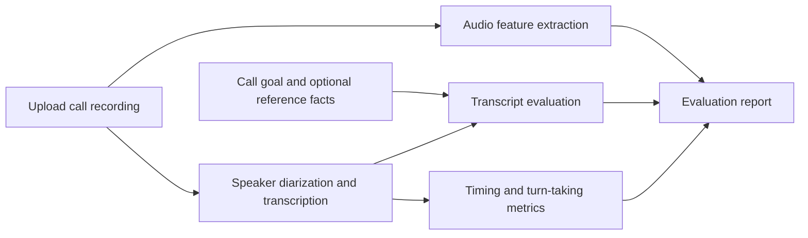

# Voice Agent Eval

A lightweight post-call evaluator for recorded customer and voice-agent conversations.

Upload an MP3 or another supported audio file, describe what the agent was expected to do, and optionally provide reference facts. The app produces a speaker-attributed transcript, a compact scorecard, and timestamped issues that help a reviewer decide where to listen.

This is a small prototype, not a production monitoring platform. The goal is to make a call easier to inspect and to keep the limits of each metric clear.

## What it evaluates

| Area | Metrics |
| --- | --- |
| Task quality | task completion, coherence, relevance, context retention, repetition |
| Responsiveness | median response time, P95 response time, longest response gap |
| Turn-taking | long pauses, estimated agent interruptions, agent speech share |
| Voice delivery | speech rate, pitch variation, loudness variation, clipping ratio |
| Facts | required-point coverage and conflicts, only when reference facts are supplied |

The app does not treat all of these as equally reliable. Timing and acoustic features are calculated from the recording. Conversation scores are model-based judgments over the transcript. Factuality is only checked against the reference information supplied for the call.

## Flow



## Output

A completed evaluation includes:

- a pass, review, or fail assessment
- task and conversation scores
- median and P95 customer-to-agent response gaps
- long pauses and estimated interruptions
- basic agent voice-delivery measurements
- fact coverage when a source of truth is supplied
- timestamped issues with supporting transcript evidence
- a downloadable JSON report

A fuller explanation of the metric definitions and their limitations is in [docs/evaluation-notes.md](docs/evaluation-notes.md).

## Run locally

### 1. Install FFmpeg

macOS:

```bash
brew install ffmpeg
```

Ubuntu or Debian:

```bash
sudo apt-get update
sudo apt-get install -y ffmpeg
```

On Windows, install FFmpeg and add it to `PATH`.

### 2. Create the environment

```bash
python -m venv .venv
source .venv/bin/activate
pip install -r requirements.txt
```

Windows PowerShell:

```powershell
.venv\Scripts\Activate.ps1
pip install -r requirements.txt
```

### 3. Configure the API key

```bash
export OPENAI_API_KEY="your-key"
```

Windows PowerShell:

```powershell
$env:OPENAI_API_KEY="your-key"
```

### 4. Start the app

```bash
streamlit run app.py
```

## Tests

```bash
pytest -q
```

The tests cover timestamp-based interaction metrics, report construction, mocked transcription and transcript-evaluation paths, and acoustic feature extraction on synthetic audio.

## Deploy from GitHub

The simplest hosted setup is Streamlit Community Cloud:

1. Create an app from this repository and select `app.py`.
2. Add `OPENAI_API_KEY` in the app's secret settings.
3. Do not commit the key to GitHub.

`packages.txt` installs FFmpeg in the hosted environment. Uploaded recordings are written to a temporary directory during evaluation and removed after processing, but the audio is sent to the configured transcription API.

For confidential recordings, use restricted access and review the data-handling requirements before deployment.

## Important limits

- The app measures the response delay heard in the recording. It cannot separate ASR, model, tool-call, TTS, or network latency without application traces.
- Interruption detection is estimated from diarized speaker timestamps and can be wrong when speakers overlap heavily.
- Pitch and loudness variation are simple acoustic signals, not emotion or personality detection.
- Business facts are not judged unless reference facts are provided.
- True transcription accuracy requires a human transcript or another trusted source of truth.
- The current thresholds are starting points. They should be calibrated against human-reviewed calls before being used for production decisions.

## Project structure

```text
app.py                         Streamlit interface
voice_eval.py                  transcription, evaluation, and audio metrics
docs/evaluation-notes.md       metric definitions and design notes
tests/                         unit and lightweight pipeline tests
requirements.txt               Python dependencies
packages.txt                   FFmpeg dependency for hosted deployment
```

## License

MIT License. Copyright 2026 Vedika Srivastava.
