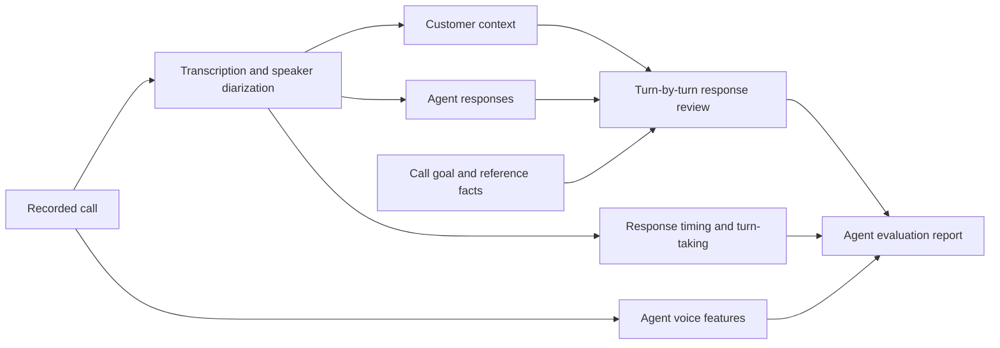

# Voice Agent Eval

[](https://github.com/VedikaSrivastava/voice-agent-eval/actions/workflows/ci.yml)
[](https://www.python.org/downloads/)
[](LICENSE)

A small post-call evaluator for recorded customer and voice-agent conversations. It combines deterministic audio metrics with structured LLM-based review of the agent's responses.

The customer side of the call is used to understand what was asked, what information was already provided, and when the customer finished speaking. The scores are about the **agent** and how well it responded. The customer is not scored.

The repository includes:

- a minimal Streamlit app for uploading a recording and reviewing the result
- an installable Python package for using the evaluator in another project
- a command-line interface that writes the same report to JSON

Install the package from PyPI:\n\n```bash\npip install voice-agent-eval\n```

## Why evaluate both audio and text?

A transcript can look correct even when the interaction feels poor because the agent interrupted the customer, paused for too long, or spoke in a flat or inconsistent way. Audio alone has the opposite problem: a call can sound smooth while the agent forgets a detail, repeats a question, or gives unsupported information.

This project keeps those signals separate in the report so that a good voice does not hide a bad answer, and a correct answer does not hide a poor interaction.

## What it evaluates

| Area | What the report looks for |
| --- | --- |
| Customer request to agent response | What the customer asked or corrected, what the agent said next, and whether it answered the request |
| Task handling | Whether the agent resolved or meaningfully advanced the purpose of the call |
| Response quality | Alignment, coherence, relevance, context retention, and unnecessary repetition |
| Responsiveness | Median, P95, and maximum delay between the end of a customer turn and the start of the agent response |
| Turn-taking | Long pauses and possible cases where the agent starts speaking before the customer finishes |
| Voice delivery | Agent speech rate, pitch variation, loudness variation, and clipping |
| Facts | Whether the agent covered or contradicted supplied reference facts or required talking points |

Timing and acoustic metrics come from the recording. Response-quality scores come from the speaker-attributed transcript. Business factuality is only checked when a source of truth is supplied.

## How it works



A report contains:

- a pass, review, or fail assessment of the agent
- task and response-quality scores
- a turn-by-turn table of what the customer asked and how the agent responded
- response-time and interruption metrics
- basic voice-delivery measurements
- fact coverage when reference information is provided
- timestamped issues and transcript evidence
- a JSON payload that can be stored or consumed by another system

See [docs/example-report.json](docs/example-report.json) for a synthetic example. The metric definitions and design decisions are explained in [docs/evaluation-notes.md](docs/evaluation-notes.md).

## Windows setup

### Requirements

- Python 3.11 or newer
- FFmpeg installed and available on `PATH`
- an OpenAI API key

Install FFmpeg with WinGet:

```bat
winget install --id Gyan.FFmpeg -e
```

Open a new Command Prompt and confirm the prerequisites are available:

```bat
py --version
ffmpeg -version
```

### Install the project

```bat
git clone https://github.com/VedikaSrivastava/voice-agent-eval.git
cd voice-agent-eval
py -m venv .venv
.venv\Scripts\activate
py -m pip install --upgrade pip
pip install -e ".[app,dev]"
```

For package-only use, it can also be installed directly from GitHub:

```bat
pip install "voice-agent-eval @ git+https://github.com/VedikaSrivastava/voice-agent-eval.git"
```

### Add the API key

Create `.env.local` from the committed example:

```bat
copy .env.local.example .env.local
```

Open `.env.local` and replace the placeholder:

```text
OPENAI_API_KEY=your-key-here
```

`.env.local` is ignored by Git and should not be committed.

## Run the app

```bat
streamlit run app.py
```

Upload an MP3, WAV, M4A, MP4, or WebM recording up to 25 MB. The page returns the scorecard, the customer-request-to-agent-response review, timestamped issues, the transcript, and a downloadable JSON report.

## Use the Python package

```python
from voice_agent_eval import VoiceAgentEvaluator


evaluator = VoiceAgentEvaluator()
report = evaluator.evaluate(
    "call.mp3",
    task="Answer the customer's question and confirm the next step",
    reference_facts=[
        "The application review takes two business days.",
        "The agent must not guarantee approval.",
    ],
)

print(report["assessment"])
print(report["agent_response"]["turn_reviews"])
```

The package reads `OPENAI_API_KEY` from `.env.local` unless a key is passed directly to `VoiceAgentEvaluator`.

## Use the command line

```bat
voice-agent-eval call.mp3 --goal "Answer the customer's question and confirm the next step" --facts-file reference_facts.txt --output report.json
```

The facts file should contain one approved fact or required talking point per line. The CLI runs the same pipeline as the app.

## What is not scored

The evaluator does not grade the customer for tone, fluency, cooperation, accent, emotion, or speaking style. Customer speech is used only to:

- identify the question, request, correction, or concern the agent needed to handle
- measure the gap before the agent answered
- detect possible agent interruptions
- check whether the agent retained information already supplied by the customer

## Validation

The normal test suite covers the package, CLI, report schema, timing metrics, audio features, and mocked API responses. CI also downloads a checksum-pinned, publicly available contact-center MP3 and exercises real MP3 decoding, FFmpeg conversion, and acoustic feature extraction. The recording is not committed to this repository.

That public-sample check validates the local audio path. A live transcription and LLM-judge run still requires an API key and a recording that the user is permitted to process. See [docs/validation.md](docs/validation.md) for the exact boundary between tested behavior and API-backed behavior.

## Current boundaries and how to address them

| Current boundary | Practical next step |
| --- | --- |
| The recording reveals the delay heard by the customer, but not the internal ASR, model, tool, TTS, or network breakdown | Accept runtime trace timestamps and join them to each turn in the report |
| Speaker diarization can be wrong, especially during overlap | Prefer separate customer and agent channels, accept an explicit speaker label, or let a reviewer correct the mapping |
| Timestamp overlap is only a possible interruption | Classify the surrounding exchange to separate natural acknowledgements from disruptive cutoffs |
| Business facts cannot be verified without a trusted reference | Add approved documents, scripts, knowledge-base retrieval, tool results, or structured call data as grounding inputs |
| True transcription accuracy is unknown without a reference transcript | Support human-corrected transcripts, known entity values, or comparison across multiple ASR systems |
| Pitch, loudness, pause, and latency thresholds are heuristics | Calibrate them against a human-reviewed call set and maintain separate baselines for each agent voice and call type |
| Model-based response scores can vary | Version the rubric and prompt, evaluate against labeled calls, and track agreement with human reviewers |

The report keeps these boundaries visible so a heuristic is not presented as ground truth.

## Tests and package build

```bat
pytest -q
py -m build
voice-agent-eval --help
```

The test suite covers timestamp metrics, mocked transcription and transcript evaluation, `.env.local` loading, CLI behavior, report construction, the Streamlit entry point, download integrity checks, and acoustic features on synthetic audio. GitHub Actions runs the same checks for branch pushes and pull requests.

## Project structure

```text
app.py                              Streamlit interface
src/voice_agent_eval/               Installable Python package
src/voice_agent_eval/models.py      Typed report and evaluation models
src/voice_agent_eval/pipeline.py    Transcription, evaluation, and audio metrics
src/voice_agent_eval/cli.py         Command-line interface
docs/evaluation-notes.md            Metric definitions and planned extensions
docs/example-report.json            Synthetic example output
docs/validation.md                  Validation scope and public-sample preflight
scripts/                             Reproducible public-sample validation scripts
tests/                              Unit and lightweight pipeline tests
pyproject.toml                       Package metadata and dependencies
```

Contributions are welcome. See [CONTRIBUTING.md](CONTRIBUTING.md) for the local checks and sample-data guidelines.

## Citation

GitHub reads the repository's [`CITATION.cff`](CITATION.cff) file and exposes a **Cite this repository** option. A BibTeX form is also provided here:

```bibtex
@software{srivastava_voice_agent_eval_2026,
  author  = {Vedika Srivastava},
  title   = {Voice Agent Eval},
  year    = {2026},
  version = {0.1.0},
  url     = {https://github.com/VedikaSrivastava/voice-agent-eval}
}
```

## License

MIT License. Copyright 2026 Vedika Srivastava.
